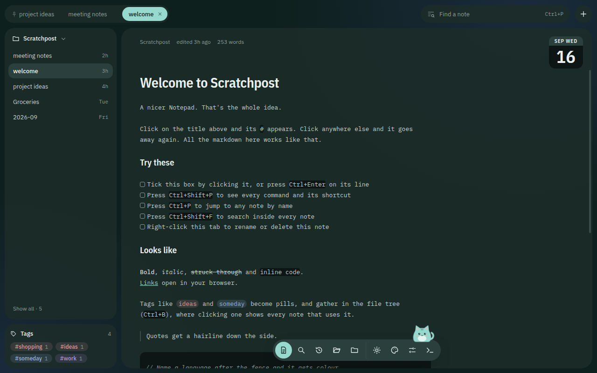
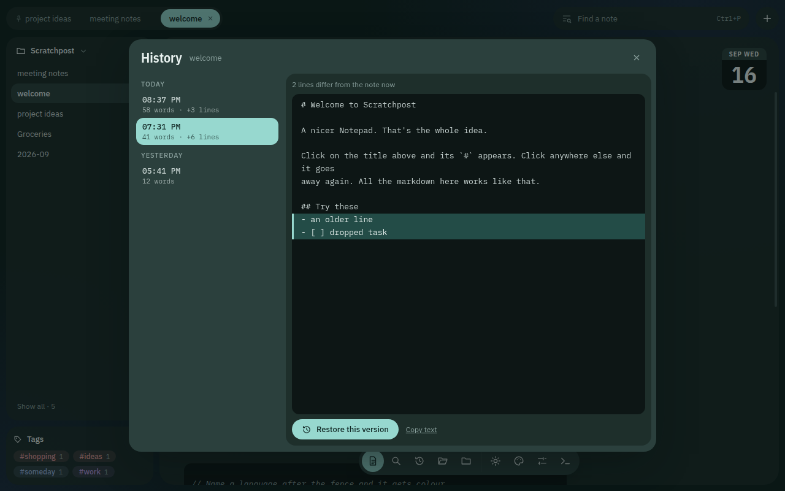

# Scratchpost

A small, single-window Markdown scratchpad for people who just want to write things down.

Your notes are shown as tabs across the top, with the editor taking up the rest of the window. Markdown renders as you type, changes are saved automatically, and files can be opened from anywhere on your computer.



## Why Scratchpost?

There are plenty of good note-taking apps, but most of them are built around the idea of managing notes.

Scratchpost isn't.

It's meant for the notes you leave open for a few days, the text file you keep coming back to, or the bit of Markdown you don't want to turn into a whole project.

It works with normal `.md` and `.txt` files. There are no vaults, databases, plugins, accounts, or sync services. Just open a file and start writing.

## Features

* **Live Markdown** — headings, lists, checklists, links, quotes, and code are rendered directly in the editor. Markdown syntax is only shown on the line you're currently editing.
* **Code highlighting** — fenced code blocks support JavaScript, TypeScript, JSON, Python, CSS, HTML, and shell.
* **Automatic saving** — changes are saved as you type. New notes are created on the first keystroke and use the first line as their filename. Empty notes aren't saved.
* **Normal files** — notes are stored in `Documents/Scratchpost` by default, or in a folder you choose. You can also open `.md` and `.txt` files from anywhere on disk.
* **Open with / drag and drop** — files can be opened from your file manager, dropped onto the window, or opened through Scratchpost's menu.
* **Quick search** — `Ctrl+P` searches your notes, `Ctrl+Shift+F` searches their contents, and `Ctrl+Shift+P` opens the command palette.
* **Tags** — add `#tags` to a note to make it available from the tags panel and use tags to filter the note list.
* **Labels** — `[labels]` are displayed as coloured pills while remaining part of the note itself.
* **File watching** — changes made to a file outside Scratchpost are detected automatically. If you've also edited the note, Scratchpost lets you choose which version to keep.
* **Version history** — notes keep a local history of previous versions. You can compare changes line-by-line and restore an older version. Restoring can be undone with `Ctrl+Z`.
* **Pinning and archiving** — pinned notes stay at the left of the tab bar. Archived notes are moved into an `archive` folder.
* **Themes** — choose light, dark, or system themes. Colours are generated from a single accent colour.
* **Offline** — everything runs locally. Scratchpost makes no network requests.



## Running from source

You'll need Node.js 22 or newer.

```bash
npm ci
npm run dev
```

The usual checks are also available:

```bash
npm run typecheck
npm run lint
npm run build
```

## Building installers

Windows:

```bash
npm run dist:win
```

This produces:

```text
dist/Scratchpost Setup <version>.exe
```

The Windows build uses NSIS. Building it on Linux requires Wine.

Linux:

```bash
npm run dist:linux
```

This produces an AppImage and a `.deb` package in `dist/`.

The installers register Scratchpost as a handler for `.md` and `.txt` files, so they can be opened directly from your file manager.

The installers are currently unsigned, so Windows SmartScreen will show a warning the first time you run the application.

## Tech stack

* [Electron](https://www.electronjs.org/) — desktop application and main/renderer processes
* [React](https://react.dev/) — UI
* [CodeMirror 6](https://codemirror.net/) — editor and Markdown support
* [electron-vite](https://electron-vite.org/) — development and builds
* [electron-builder](https://www.electron.build/) — application packaging
* [chokidar](https://github.com/paulmillr/chokidar) — filesystem watching

IBM Plex fonts are bundled with the application. Scratchpost does not need an internet connection to run.
